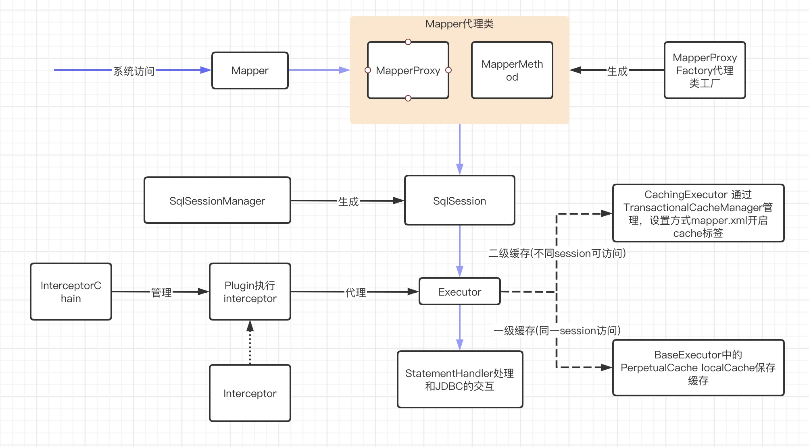

#### MyBatis原理文档

##### MyBatis代理原理
使用Proxy的方式实现动态代理，Mapper的代理入口函数MapperProxy

##### MyBatis架构图

##### MyBatis缓存模型
* 一级缓存
* 二级缓存

##### MyBatis拦截器原理
在通过configuration创建executor时，执行InterceptorChain调用Plugin生成executor的代理类，当SqlSession调用executor时先执行代理接口的invoke方法，invoke方法中调用Interceptor.intercept

##### MyBatis动态sql及配置
> https://mybatis.org/mybatis-3/zh/index.html